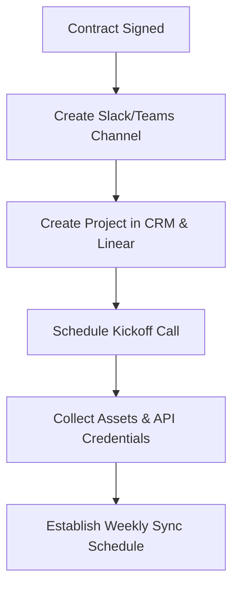
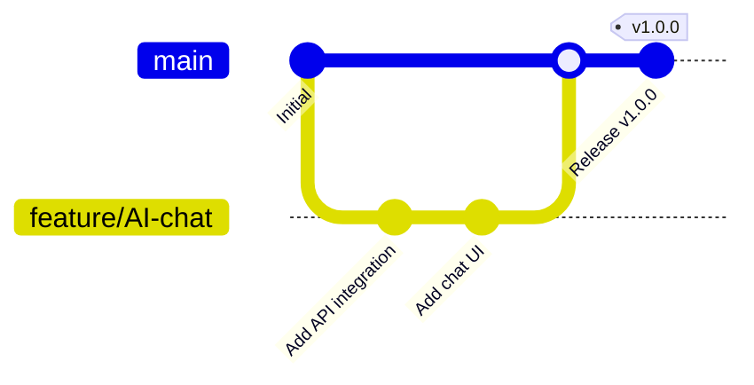

# Bryntix Labs: Operations & Engineering Guide

This guide establishes the operational protocols, engineering standards, project management workflows, and security practices for **Bryntix Labs**.

---

## 1. Team Roles & Permission Management

Protect customer and company data using a strict **Principle of Least Privilege (PoLP)**.

### Access Levels Definition

| Role | Repository Access | Cloud Infrastructure (AWS/GCP) | Project Management (Linear/Jira) | Client Production Data |
| :--- | :--- | :--- | :--- | :--- |
| **Director / CTO** | Admin (All repos) | Admin / Billing owner | Administrator | Full Access (if required) |
| **Tech Lead** | Maintainer (All project repos) | Developer / Read-Write | Manager / Team Lead | Read-only (via Bastion/IAM) |
| **Software Engineer**| Developer (Assigned repos) | Read-only / Sandbox | Standard User | No Access |
| **UI/UX Designer** | Reader / No Code Access | No Access | Standard User | No Access |
| **Project Manager** | Reader / No Code Access | No Access | Administrator | No Access |

> [!IMPORTANT]
> - **Multi-Factor Authentication (MFA)** must be enforced across all corporate accounts (Google Workspace, GitHub, AWS, Stripe).
> - Use single-sign-on (SSO) configurations where possible.

---

## 2. Client Onboarding Process

A professional onboarding process sets expectations and builds trust.



### Steps:
1. **Kickoff Meeting**: Align on deliverables, project timeline, and communication protocols.
2. **Access Collection**: Request API credentials, existing codebases, and brand assets via a secure vault (e.g., 1Password or Bitwarden).
3. **Communication Setup**: Provision a dedicated Slack channel (e.g., `#bryntix-clientname`) and invite client stakeholders.
4. **Project Dashboard**: Invite clients to a read-only project board (or share weekly status reports).

---

## 3. Proposal and Quotation Template

Every proposal must contain:

- **Executive Summary**: Brief description of the client's problem and how Bryntix Labs' solutions (AI/Web/Mobile) will solve it.
- **Scope of Work (SOW)**: Bulleted list of features, screens, and API integrations.
- **Technology Stack**: Proposed backend, frontend, and cloud services (e.g., Next.js, Flutter, AWS).
- **Phased Timeline & Deliverables**:
  - Phase 1: UX/UI & Discovery (Weeks 1-4)
  - Phase 2: Core Development & Integration (Weeks 5-12)
  - Phase 3: QA, Beta, & Deployment (Weeks 13-16)
- **Financial Quotation**: Itemized pricing per phase or milestone.
- **Assumptions & Exclusions**: What is *not* included (e.g., App Store registration fees, third-party API costs).

---

## 4. Invoicing, Inward Remittance & Accounting

### Software & Billing Stack
- **Invoicing Platform**: **Zoho Books** or **Razorpay Invoicing** (GST-compliant, supports Indian e-invoicing).
- **International Payouts/Remittance**: Use **Stripe**, **Wise Business**, or **Inward Wire Transfer (Swift)**.
- **Export Invoices (Export under LUT)**: Ensure foreign currencies (USD, EUR) are converted through your bank, and request the bank to issue an **e-FIRC** (Electronic Foreign Inward Remittance Certificate) for every payment.

---

## 5. CRM & Project Management

- **CRM**: **HubSpot (Free/Starter)** for deal pipeline tracking and client communication history.
- **Project Management**: **Linear** (recommended for speed, clean UX, and developer focus) or **Jira** (if corporate clients require formal Agile/Scrum reporting).
- **Linear Workflow Setup**:
  - `Backlog` -> `Todo` -> `In Progress` -> `In Review` -> `Done`

---

## 6. Development Workflow (Agile/Scrum)

- **Sprint Duration**: 2 weeks.
- **Sprint Ceremonies**:
  - **Sprint Planning**: Alternate Mondays, 10:00 AM (Define Sprint Goal, commit to tickets).
  - **Daily Standup**: Mon-Fri, 15 minutes (What I did, what I will do, blockers).
  - **Sprint Review & Demo**: Alternate Fridays, 4:00 PM (Showcase functional code to internal stakeholders or clients).

---

## 7. Git Branching Strategy: Trunk-Based Development

For rapid iterations and CI/CD automation, Bryntix Labs uses **Trunk-Based Development** with short-lived feature branches.



### Rules:
- All developers merge directly to `main` via short-lived feature branches (`feature/*`).
- Feature branches should not live longer than **2 days**.
- Every Merge Request (MR) / Pull Request (PR) requires:
  - Passage of automated linting and unit test suites.
  - Approval from at least one Tech Lead.
- Use **Feature Flags** (e.g., LaunchDarkly, PostHog) to merge incomplete features into production safely.

---

## 8. CI/CD Pipeline Recommendations

Automate all build and deployment tasks to reduce human error.

### Pipeline Configs:
- **Web Frontend (Next.js / React)**: Deploy to **Vercel** or **Netlify** automatically on merges to `main`.
- **Mobile Apps (Flutter / React Native)**: Use **Codemagic** or **GitHub Actions** with **Fastlane** to build and distribute beta builds to Google Play Internal Sharing and Apple TestFlight.
- **Backend / AI Services**: Deploy to **AWS ECS/Fargate** or **GCP Cloud Run** using GitHub Actions workflows.

---

## 9. Security Best Practices

Protecting your source code and client data is non-negotiable.

### Security Checklist
- [ ] **Secrets Management**: Never commit API keys, DB passwords, or credentials to git. Use **GitHub Secrets**, **AWS Secrets Manager**, or **Doppler**.
- [ ] **Static Code Analysis (SAST)**: Integrate **SonarQube** or **Snyk** into the CI/CD pipeline to catch vulnerabilities and outdated dependencies.
- [ ] **Database Access**: Production databases must be in private subnets, accessible only via a VPN or Bastion Host with temporary IAM credentials.
- [ ] **OWASP Top 10 Compliance**: Enforce SQL injection protection, XSS protection, rate limiting, and secure cookie headers across all APIs.

---

## 10. Documentation Standards

A software company's value is in its codebase and its documentation.

- **System Architecture**: Use the **C4 Model** (Context, Containers, Component, Code) for architecture diagrams.
- **API Documentation**: Every API must be documented using **Swagger/OpenAPI** specs, allowing interactive testing.
- **Code Comments**: Keep comments concise. Document *why* something is done, not *what* is done (which should be clear from readable code).

---

## 11. Company Shared Drive Structure

Organize the corporate shared storage (Google Drive/SharePoint) as follows:

```text
Bryntix Labs Root/
├── 01_Corporate/
│   ├── Incorporation_Legal/
│   ├── Financials_Taxes/
│   └── Board_Meetings/
├── 02_Human_Resources/
│   ├── Hiring_Contracts/
│   ├── Onboarding_Checklists/
│   └── Payroll_Reimbursements/
├── 03_Operations/
│   ├── Standard_Operating_Procedures/
│   └── Marketing_Assets/
└── 04_Client_Projects/
    ├── Client_A/
    │   ├── Contracts_SOW/
    │   ├── Designs_Assets/
    │   └── Technical_Specs/
    └── Client_B/
```

---

## 12. Standard Operating Procedures (SOPs)

### SOP: Deploying a Backend Hotfix
1. **Locate Issue**: File a bug ticket in Linear. Link the Sentry error trace if available.
2. **Branch Creation**: Create a branch off `main` named `hotfix/bug-description`.
3. **Local Testing**: Verify the fix locally and write a unit test to prevent regression.
4. **Pull Request**: Create a PR to `main`. Add detailed replication steps, logs, and a video showing the fix.
5. **Code Review**: Obtain approval from the Tech Lead.
6. **Deployment**: Merge the PR. The CI/CD pipeline will automatically run tests and deploy to Staging.
7. **Production Release**: Once verified on Staging, promote the build to Production.
8. **Verification**: Manually confirm the fix on Production and resolve the Linear ticket.
